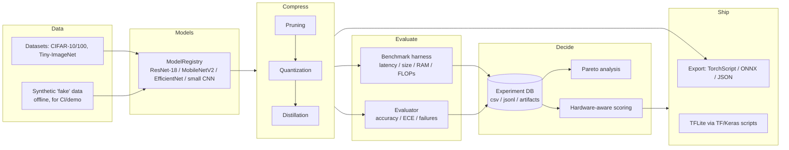

<div align="center">

# Hardware-Aware Neural Network Compression & AutoML for the Edge

**Smaller, faster, still-accurate deep-learning models for edge devices — with a reproducible pipeline for searching the accuracy / latency / size trade-off space.**

[](https://github.com/eshaan2418/Edge-AI-Model-Compression-Deployment/actions/workflows/ci.yml)


</div>

---

## Overview

Deploying deep models to phones, single-board computers, and microcontrollers is
a **multi-objective** problem: accuracy, latency, model size, and RAM all pull
against each other, and the "best" model depends on the *target device*. This
project treats that as a first-class engineering problem rather than a one-off
script — with reproducible experiments, a tracked experiment database,
multi-objective (Pareto) analysis, hardware-aware feasibility scoring, and honest
export tooling.

Everything runs on a normal **CPU** — no GPU required — and the entire test suite
and demo are **offline** (no downloads).

The repository contains **two independent stacks**; pick the one that matches your
goal:

| Stack | Framework | Location | Use it for |
|-------|-----------|----------|------------|
| **Research framework** | PyTorch | `edge_ai_compression/` (+ legacy `mc` CLI in `src/model_compression/`) | End-to-end compression experiments: prune / quantize / distill, benchmark, multi-objective search, Pareto analysis, and experiment tracking. |
| **TFLite deployment scripts** | TensorFlow / Keras | root `*.py` scripts | Producing and benchmarking a ResNet-50 CIFAR-10 baseline and TFLite artifacts (dynamic-range and full-integer int8). |

The two stacks share no dependencies — the PyTorch framework does not require
TensorFlow, and vice versa.

## Contents

- [Key features](#key-features)
- [Quick start](#quick-start)
- [Architecture](#architecture)
- [PyTorch research framework](#pytorch-research-framework)
- [Command-line tools](#command-line-tools)
- [TensorFlow / TFLite scripts](#tensorflow--tflite-scripts)
- [Repository layout](#repository-layout)
- [Development](#development)
- [Honesty & limitations](#honesty--limitations)
- [Roadmap](#roadmap)
- [License](#license)

## Key features

- **60-second offline demo.** `python -m edge_ai_compression.demo --quick` prunes
  and quantizes a model and prints a size/latency trade-off table — no downloads,
  no GPU.
- **Reproducible experiments.** An opt-in experiment database captures the
  environment, model summary, metrics, and artifacts for every run, plus a
  standalone reproducibility-manifest tool (git state, package versions, config
  hash, seeds).
- **Multi-objective analysis.** A Pareto-frontier CLI and an NSGA-II search over
  the compression trade-off space.
- **Hardware-aware scoring.** Score a model's metrics against documented device
  budgets (Raspberry Pi, smartphone, microcontroller) for feasibility, and compare
  a candidate across every profile at once.
- **Honest export.** TorchScript / ONNX / JSON export with clear, actionable
  errors — no fabricated TFLite placeholders.
- **Reporting.** Generate self-contained HTML reports and honest Markdown model
  cards that flag synthetic metrics and never overstate production readiness.
- **Fast, offline CI.** The full suite is CPU-only and network-free, and runs on a
  Python 3.11 + 3.12 matrix.

## Quick start

```bash
git clone https://github.com/eshaan2418/Edge-AI-Model-Compression-Deployment.git
cd Edge-AI-Model-Compression-Deployment

python3 -m venv .venv
source .venv/bin/activate          # macOS/Linux  (Windows: .venv\Scripts\activate)
python -m pip install -U pip

# PyTorch research framework + dev tools (ruff, pytest):
pip install -e ".[dev]"
```

**Run the offline demo** (CPU-only, synthetic data, no downloads):

```bash
python -m edge_ai_compression.demo --quick
```

It benchmarks a small model, prunes and dynamically quantizes it, prints a
trade-off table, and writes JSON/Markdown reports to `results/demo/`.

**Run a tiny end-to-end experiment** (fully offline, ~3s on CPU):

```bash
python run_experiment.py --config edge_ai_compression/configs/experiments/smoke_cpu.yml
```

The smoke config uses a synthetic `fake` dataset (random CIFAR-shaped tensors — no
files, no network), prunes a ResNet-18 to 50% sparsity, evaluates it, and appends
a row to `edge_ai_compression/results/benchmark_append.md`. Swap `dataset: fake`
→ `dataset: cifar10` for a real run.

> **Note.** Metrics produced from the `fake` dataset (the demo and CI) are
> plumbing/sanity numbers measured on **randomly labeled data** — not measures of
> model quality. Real accuracy comes only from CIFAR / Tiny-ImageNet runs.

### Optional extras

```bash
pip install -e ".[tf-mot]"   # TensorFlow + tf-keras + TF-MOT (the root TF/TFLite scripts)
pip install -e ".[viz]"      # matplotlib (plot_results.py)
pip install -e ".[docs]"     # MkDocs (serve the docs locally)
pip install -e ".[all]"      # everything above
```

`pyproject.toml` is the single source of truth for dependencies; `requirements.txt`
installs `-e .[dev]` and `environment.yml` creates a conda env with `-e .[all]` —
both just point at it.

## Architecture



For a deeper tour, start at the [documentation landing page](docs/index.md), then
see [architecture](docs/architecture.md) for a component-level walkthrough,
[experiments](docs/experiments.md) for the experiment/DB workflow,
[deployment](docs/deployment.md) for export and hardware targets, and the
[guided demo](docs/recruiter_demo.md) for a five-minute tour. The docs render on
GitHub as-is, or serve them locally with `pip install -e ".[docs]"` then
`mkdocs serve`.

## PyTorch research framework

Run a compression experiment from a YAML config:

```bash
# Fast smoke test (synthetic data, offline, ~3s):
python run_experiment.py --config edge_ai_compression/configs/experiments/smoke_cpu.yml

# Full runs (download and use the whole dataset — slower):
python run_experiment.py --config edge_ai_compression/configs/experiments/baseline_eval.yml
python run_experiment.py --config edge_ai_compression/configs/experiments/prune_then_eval.yml
```

Two knobs keep runs cheap: `dataset: fake` (aliases `synthetic` / `debug` /
`random`) generates random CIFAR-shaped tensors with no network access, and
`limit_samples: <N>` caps each split to its first N examples. Real datasets
(`cifar10`, `cifar100`, `tiny_imagenet`) are unchanged — drop both knobs for a full
experiment.

Additional entrypoints (all support `--help`):

```bash
python auto_compress.py --device cpu --max-latency-ms 50 \
  --max-size-mb 50 --min-accuracy 0.5 --budget 4   # constrained AutoML search
python search_compression.py --objective pareto \
  --results results/experiments.csv                 # Pareto frontier from logged runs
python train_surrogate.py --results results/experiments.csv --out results/surrogates
python analyze_failures.py --experiment-id <uuid>
python plot_results.py                              # needs .[viz]
python launch_sweep.py --config configs/sweeps/full_compression_study.yml
python resume_sweep.py --sweep-id full_compression_study
```

### Capabilities

| Area | Capability |
|------|------------|
| **Experiment DB** | Opt-in logging to `results/experiments.csv` / `.jsonl` and `results/artifacts/{id}/` (config, metrics, `model.pt`, latency trace, confusion matrix, failure cases). Enable via `experiment_db.enabled: true` (see `configs/experiments/with_experiment_db.yml`). |
| **Pruning** | Global unstructured (`magnitude`) and `layerwise_adaptive` with `magnitude` / `gradient` / `activation` / `ablation` scorers. |
| **Quantization** | Dynamic linear (PyTorch). |
| **Distillation** | Knowledge distillation from a teacher checkpoint (temperature + alpha). |
| **Compression order** | Configurable via `compression_order` / `compression_order_tag` (e.g. `distill>prune>quantize`). |
| **Multi-objective** | Pareto frontier + NSGA-II (`optimization/search/nsga2.py`). |
| **Surrogates / policy** | RF / MLP / GP surrogates on the results CSV; constraint-feasible row selection. |
| **Diagnostics** | Confusion matrices, per-class accuracy, ECE, NLL, failure cases. |
| **Datasets** | `cifar10`, `cifar100`, `tiny_imagenet`, and `fake` (synthetic, offline) via `build_loaders()`. |

### Legacy `mc` CLI

`src/model_compression/` is a smaller, self-contained ResNet-18 pipeline exposed as
the `mc` console script (installed with the package):

```bash
mc train --max-batches 5      # quick baseline train (smoke)
mc prune  --help
mc quantize --help
mc distill --help
```

`python train.py --max-batches 5` is a thin wrapper around `mc train`.

## Command-line tools

Standalone, offline tools — all support `--help`:

| Command | Description |
|---------|-------------|
| `python -m edge_ai_compression.demo --quick` | Offline synthetic prune+quantize demo → trade-off table + `results/demo/`. |
| `python -m edge_ai_compression.benchmarking.benchmark_model --model resnet18_cifar` | Benchmark a model on synthetic input (latency percentiles, size, params, FLOPs, RAM) → JSON. |
| `python -m edge_ai_compression.analysis.pareto --results results/experiments.csv --out results/pareto` | Pareto frontier over logged runs → `pareto_frontier.csv/.md` (`--plot` optional). |
| `python -m edge_ai_compression.analysis.search_space --config configs/sweeps/full_compression_study.yml` | Summarize a sweep's candidate count and dimensions before running it. |
| `python -m edge_ai_compression.hardware.score --metrics results/benchmark.json --profile raspberry_pi` | Score metrics against a single device budget (feasibility, utilization, violations). |
| `python -m edge_ai_compression.hardware.compare --metrics results/demo/report.json` | Rank one model's metrics against every hardware profile (feasible-first, scored). |
| `python -m edge_ai_compression.config.validate <config.yml> [--strict]` | Validate an experiment config against the runner schema (registry-checked model/dataset). |
| `python -m edge_ai_compression.recipes.list` / `.show <name>` / `.apply --recipe <name> --base-config <cfg> --out <path>` | Named compression recipes → generate a merged, schema-valid config (no training). |
| `python -m edge_ai_compression.export --model resnet18_cifar --format torchscript` | Export a model: `torchscript` / `onnx` / `json` (metadata) / `tflite` (guided error). |
| `python -m edge_ai_compression.reporting.generate_report --demo results/demo/report.json --out reports/index.html` | Build a self-contained HTML report (+ JSON summary) from demo/benchmark/pareto/hardware outputs. |
| `python -m edge_ai_compression.reporting.model_card --metrics results/demo/report.json --profile raspberry_pi` | Generate an honest Markdown model card (flags synthetic metrics; no production claims without real data). |
| `python -m edge_ai_compression.repro.manifest --config <config.yml>` | Capture a reproducibility manifest (git state, environment, package versions, config hash, seeds). |

> Hardware profiles (`cpu`, `raspberry_pi`, `smartphone`, `microcontroller_sim`)
> are **documented planning budgets, not measured device ceilings** — confirm on
> real hardware before shipping. See [deployment](docs/deployment.md).

## TensorFlow / TFLite scripts

These produce a ResNet-50 CIFAR-10 baseline and TFLite artifacts. Install the TF
extra first:

```bash
pip install -e ".[tf-mot]"
```

> **Keras 3 note.** These scripts target the Keras 2 SavedModel API and set
> `TF_USE_LEGACY_KERAS=1` at import time (satisfied by the `tf-keras` package that
> the `tf` / `tf-mot` extras install). No manual configuration needed.

Every script takes CLI flags and a `--limit` (or `--num-calibration-samples`) smoke
knob — no source editing required:

```bash
# 1) Train a baseline → models/baseline_model/  (--weights none skips the ImageNet download)
python train_baseline.py --epochs 1 --limit 256 --weights none

# 2) Quantize → models/quantized_dynamic_range.tflite + models/quantized_integer_only.tflite
python quantize_model.py --num-calibration-samples 50

# 3) Prune (TF-MOT) → models/pruned_model/
python prune_model.py --epochs 1 --limit 256

# 4) Distill a compact student → models/student_model/
python distill_model.py --epochs 1 --limit 256

# 5) Benchmark any SavedModel dir or .tflite file (size, latency, RAM, accuracy)
python benchmark.py --model-path models/baseline_model --limit 200
python benchmark.py --model-path models/quantized_integer_only.tflite --limit 200

# Combine pruning + full-integer quantization:
python combine_and_quantize.py --pruned models/pruned_model \
  --out models/combined_pruned_quantized.tflite --num-calibration-samples 50
```

`benchmark.py` appends a row to `benchmark_results.md` on each run.

## Repository layout

```
edge_ai_compression/     PyTorch research framework (models, data, compression, search, DB)
src/model_compression/   Legacy PyTorch ResNet-18 pipeline (the `mc` CLI)
train.py, run_experiment.py, auto_compress.py, search_compression.py, ...   root wrappers
train_baseline.py, prune_model.py, quantize_model.py, distill_model.py      TF/Keras scripts
benchmark.py, combine_and_quantize.py                                        TFLite tooling
configs/, edge_ai_compression/configs/                                       YAML configs
docs/                    Documentation (MkDocs-compatible)
tests/                   pytest suite (CPU, no network)
models/, data/, results/, reports/   generated artifacts (git-ignored)
```

Generated artifacts (weights, datasets, sweeps, plots, reports, virtualenvs,
caches) are **git-ignored** — the repository ships code, not results.

## Development

```bash
ruff check .          # lint (enforced in CI)
ruff format .         # auto-format
pytest -q             # tests (CPU-only, network-free, a few seconds)
```

CI (`.github/workflows/ci.yml`) runs lint, format-check, byte-compilation, the test
suite, a config-validation smoke check, and the offline demo — as separate steps
across a **Python 3.11 + 3.12** matrix, all CPU-only and network-free.

## Honesty & limitations

This project is deliberate about not overstating results:

- **Synthetic ≠ real.** Anything run on the `fake` dataset (CI, the demo) uses
  random labels; those numbers verify plumbing, not model quality. Real accuracy
  comes only from CIFAR / Tiny-ImageNet runs.
- **Hardware profiles are budgets.** Device numbers are documented planning
  targets, not measurements from physical hardware.
- **No fabricated exports.** TFLite export from PyTorch is refused with guidance
  rather than emitting a placeholder; the real TFLite path is the TF/Keras scripts.
- **No committed artifacts.** Weights, datasets, and benchmark outputs are
  git-ignored; the repository ships code, not results.

## Roadmap

- Structured (channel) pruning with real FLOP reduction, not just sparsity.
- Static / QAT quantization paths alongside dynamic quantization.
- End-to-end ONNX → TFLite conversion helper (currently a guided manual path).
- On-device latency measurement to validate the hardware-profile budgets.
- Expanded surrogate models and Bayesian optimization for the search loop.

## License

Released under the [MIT License](LICENSE).

## Acknowledgements

Built on PyTorch and torchvision; TensorFlow / Keras, the TensorFlow Model
Optimization Toolkit (TF-MOT), and TFLite for the deployment-oriented quantization
path.
