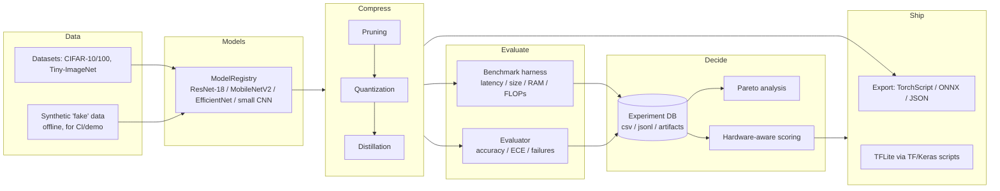

<div align="center">

# Hardware‑Aware Neural Network Compression & AutoML (Edge)

Smaller, faster, still‑accurate deep‑learning models for edge devices — with a
research pipeline for searching the compression trade‑off space.


</div>

This repository contains **two complementary stacks**. Pick the one that matches
what you want to do:

| Stack | Language | Where | Use it for |
|-------|----------|-------|------------|
| **Research framework** | PyTorch | `edge_ai_compression/` (+ `src/model_compression/` legacy CLI) | End‑to‑end compression experiments on CPU: prune / quantize / distill, benchmark, multi‑objective search, Pareto analysis, experiment tracking. |
| **TFLite deployment scripts** | TensorFlow / Keras | root `*.py` (`train_baseline.py`, `prune_model.py`, `quantize_model.py`, `distill_model.py`, `benchmark.py`) | Producing and benchmarking a ResNet50 CIFAR‑10 baseline and TFLite artifacts (dynamic‑range + full‑integer int8). |

The two stacks are independent — the PyTorch framework does **not** require
TensorFlow, and vice versa. Everything runs on a normal **CPU**; no GPU needed.

### Why this project

Deploying deep models to phones, SBCs, and microcontrollers is a
multi-objective problem: accuracy, latency, model size, and RAM all pull against
each other, and the "best" model depends on the *target device*. This repo treats
that as a first-class engineering problem — reproducible compression experiments,
a tracked experiment database, multi-objective (Pareto) analysis, hardware-aware
feasibility scoring, and honest export tooling — rather than a one-off script.

### Highlights

- **60-second offline demo** — `python -m edge_ai_compression.demo --quick`
  prunes + quantizes a model and prints a size/latency trade-off table. No
  downloads, no GPU.
- **Reproducible experiment DB** — every run can capture environment, model
  summary, metrics, and artifacts.
- **Multi-objective analysis** — Pareto frontier CLI + NSGA-II search over the
  compression trade-off space.
- **Hardware-aware scoring** — score a model's metrics against documented device
  budgets (Raspberry Pi, smartphone, MCU) for feasibility.
- **Honest export** — TorchScript / ONNX / JSON with clear, actionable errors; no
  fake TFLite placeholders.
- **Fast & offline CI** — the whole test suite is CPU-only and needs no network.

### Architecture at a glance



See [`docs/architecture.md`](docs/architecture.md) for a component-level tour,
[`docs/experiments.md`](docs/experiments.md) for the experiment/DB workflow,
[`docs/deployment.md`](docs/deployment.md) for export + hardware targets, and
[`docs/recruiter_demo.md`](docs/recruiter_demo.md) for a 5-minute guided tour.

---

## 60-second offline demo

```bash
pip install -e ".[dev]"
python -m edge_ai_compression.demo --quick     # or: python demo.py --quick
```

This runs entirely on CPU with **synthetic data** (no downloads): it benchmarks a
small model, prunes + dynamically quantizes it, and prints a trade-off table plus
JSON/Markdown reports under `results/demo/`.

> The demo's `synthetic_accuracy` is measured on **randomly labeled fake data** —
> it is a plumbing/sanity number, not a quality metric. For real accuracy, run the
> experiment runner on CIFAR.

---

## Quickstart (5 minutes, CPU‑only)

```bash
git clone https://github.com/eshaan2418/Edge-AI-Model-Compression-Deployment.git
cd Edge-AI-Model-Compression-Deployment

python3 -m venv .venv
source .venv/bin/activate          # macOS/Linux  (Windows: .venv\Scripts\activate)
python -m pip install -U pip

# PyTorch research framework + dev tools (ruff, pytest):
pip install -e ".[dev]"

# Sanity check:
ruff check .
pytest -q                          # CPU-only, a few seconds, no downloads

# Tiny end‑to‑end experiment — fully offline, no downloads, ~3s on CPU:
python run_experiment.py --config edge_ai_compression/configs/experiments/smoke_cpu.yml
```

The smoke config (`smoke_cpu.yml`) uses a **synthetic `fake` dataset** (random
CIFAR‑shaped tensors — no files, no network), prunes a ResNet‑18 to 50%
sparsity, evaluates it, and appends a row to
`edge_ai_compression/results/benchmark_append.md`. The whole pipeline finishes
in a few seconds. Swap `dataset: fake` → `dataset: cifar10` in the config for a
real run.

### Optional extras

```bash
pip install -e ".[tf-mot]"   # TensorFlow + tf-keras + tf-mot (the root TF/TFLite scripts)
pip install -e ".[viz]"      # matplotlib (plot_results.py)
pip install -e ".[all]"      # everything above
```

`requirements.txt` installs `-e .[dev]`; `environment.yml` creates a conda env
with `-e .[all]`. `pyproject.toml` is the single source of truth for
dependencies — the other two just point at it.

---

## PyTorch research framework (`edge_ai_compression`)

Run a compression experiment from a YAML config:

```bash
# Fast smoke test (synthetic data, offline, ~3s):
python run_experiment.py --config edge_ai_compression/configs/experiments/smoke_cpu.yml

# Full runs (download + use the whole dataset — slower):
python run_experiment.py --config edge_ai_compression/configs/experiments/baseline_eval.yml
python run_experiment.py --config edge_ai_compression/configs/experiments/prune_then_eval.yml
```

Two knobs keep runs cheap: `dataset: fake` (aliases `synthetic` / `debug` /
`random`) generates random CIFAR‑shaped tensors with no network access, and
`limit_samples: <N>` caps each split to its first N examples. Real datasets
(`cifar10`, `cifar100`, `tiny_imagenet`) are unchanged — drop both knobs for a
full experiment.

Other entrypoints (all support `--help`):

```bash
python auto_compress.py --device cpu --max-latency-ms 50 \
  --max-size-mb 50 --min-accuracy 0.5 --budget 4     # constrained AutoML search (runs `budget` full experiments)
python search_compression.py --objective pareto \
  --results results/experiments.csv                   # Pareto frontier from logged runs
python train_surrogate.py --results results/experiments.csv --out results/surrogates
python analyze_failures.py --experiment-id <uuid>
python plot_results.py                                # needs .[viz]
python launch_sweep.py --config configs/sweeps/full_compression_study.yml
python resume_sweep.py --sweep-id full_compression_study
```

### Legacy PyTorch CLI (`mc`)

`src/model_compression/` is a smaller, self‑contained ResNet‑18 pipeline exposed
as the `mc` console script (installed with the package):

```bash
mc train --max-batches 5      # quick baseline train (smoke)
mc prune  --help
mc quantize --help
mc distill --help
```

`python train.py --max-batches 5` is a thin wrapper around `mc train`.

### What the framework implements

| Area | Capability |
|------|------------|
| **Experiment DB** | Opt‑in logging to `results/experiments.csv` / `.jsonl` and `results/artifacts/{id}/` (config, metrics, `model.pt`, latency trace, confusion matrix, failure cases). Enable with `experiment_db.enabled: true` (see `configs/experiments/with_experiment_db.yml`). |
| **Pruning** | Global unstructured (`magnitude`) and `layerwise_adaptive` with `magnitude` / `gradient` / `activation` / `ablation` scorers. |
| **Quantization** | Dynamic linear (PyTorch). |
| **Distillation** | KD from a teacher checkpoint (temperature + alpha). |
| **Compression order** | `compression_order` / `compression_order_tag` (e.g. `distill>prune>quantize`). |
| **Multi‑objective** | Pareto frontier + NSGA‑II (`optimization/search/nsga2.py`). |
| **Surrogates / policy** | RF/MLP/GP surrogates on the results CSV; constraint‑feasible row selection. |
| **Diagnostics** | Confusion matrices, per‑class accuracy, ECE, NLL, failure cases. |
| **Datasets** | `cifar10`, `cifar100`, `tiny_imagenet`, and `fake` (synthetic, offline) via `build_loaders()`. |

Layout: `core`, `compression`, `optimization`, `benchmarking`, `hardware`,
`analysis`, `data`, `utils`, `experiment_db`, `surrogate`, `policy`, `theory`,
`configs/`, `experiments/`, `auto_compress.py`.

### Analysis & deployment CLIs

Standalone, offline command-line tools (all support `--help`):

| Command | What it does |
|---------|--------------|
| `python -m edge_ai_compression.demo --quick` | Offline synthetic prune+quantize demo → trade-off table + `results/demo/`. |
| `python -m edge_ai_compression.benchmarking.benchmark_model --model resnet18_cifar` | Benchmark a model on synthetic input (latency percentiles, size, params, FLOPs, RAM) → JSON. |
| `python -m edge_ai_compression.analysis.pareto --results results/experiments.csv --out results/pareto` | Pareto frontier over logged runs → `pareto_frontier.csv/.md` (+ `--plot`). |
| `python -m edge_ai_compression.hardware.score --metrics results/benchmark.json --profile raspberry_pi` | Score metrics against a device budget (feasible? utilization? violations?). |
| `python -m edge_ai_compression.export --model resnet18_cifar --format torchscript` | Export a model: `torchscript` / `onnx` / `json` (metadata) / `tflite` (guided error). |

Hardware profiles (`cpu`, `raspberry_pi`, `smartphone`, `microcontroller_sim`)
are **documented planning budgets, not measured device ceilings** — confirm on
real hardware before shipping. See [`docs/deployment.md`](docs/deployment.md).

---

## TensorFlow / Keras TFLite scripts (root)

These produce a ResNet50 CIFAR‑10 baseline and TFLite artifacts. Install the TF
extra first:

```bash
pip install -e ".[tf-mot]"
```

> **Keras 3 note:** these scripts target the Keras 2 SavedModel API and set
> `TF_USE_LEGACY_KERAS=1` at import time (satisfied by the `tf-keras` package
> that the `tf`/`tf-mot` extras install). No manual configuration needed.

Every script takes CLI flags and a `--limit` (or `--num-calibration-samples`)
smoke knob, so you no longer need to edit source with `sed`:

```bash
# 1) Train a baseline -> models/baseline_model/  (--weights none skips ImageNet download)
python train_baseline.py --epochs 1 --limit 256 --weights none

# 2) Quantize -> models/quantized_dynamic_range.tflite + models/quantized_integer_only.tflite
python quantize_model.py --num-calibration-samples 50

# 3) Prune (TF‑MOT) -> models/pruned_model/
python prune_model.py --epochs 1 --limit 256

# 4) Distill a compact student -> models/student_model/
python distill_model.py --epochs 1 --limit 256

# 5) Benchmark any SavedModel dir or .tflite file (size, latency, RAM, accuracy)
python benchmark.py --model-path models/baseline_model --limit 200
python benchmark.py --model-path models/quantized_integer_only.tflite --limit 200

# Combine pruning + full-integer quantization:
python combine_and_quantize.py --pruned models/pruned_model \
  --out models/combined_pruned_quantized.tflite --num-calibration-samples 50
```

`benchmark.py` appends a row to `benchmark_results.md` on each run.

---

## Repository map

```
edge_ai_compression/     PyTorch research framework (models, data, compression, search, DB)
src/model_compression/   Legacy PyTorch ResNet-18 pipeline (the `mc` CLI)
train.py run_experiment.py auto_compress.py search_compression.py ...   root wrappers
train_baseline.py prune_model.py quantize_model.py distill_model.py     TF/Keras scripts
benchmark.py combine_and_quantize.py                                     TFLite tooling
configs/  edge_ai_compression/configs/                                   YAML configs
tests/                   pytest suite (CPU, no network)
models/  data/  results/  benchmark_results.md   generated artifacts (git-ignored)
```

Generated artifacts (`models/`, `data/`, dataset downloads, `results/artifacts`,
sweeps, plots, virtualenvs, caches) are **git‑ignored** — the repo stays lean.

---

## Development

```bash
ruff check .          # lint (also enforced in CI)
ruff format .         # auto-format
pytest -q             # tests
```

CI (`.github/workflows/ci.yml`) runs `ruff check .`, `ruff format --check .`,
`pytest -q`, `python -m compileall`, and the offline demo on Python 3.11 — all
CPU-only and network-free.

## Honesty & limitations

This project is deliberate about not overstating results:

- **Synthetic ≠ real.** Anything run on the `fake` dataset (CI, the demo) uses
  random labels. Those numbers verify plumbing, not model quality. Real accuracy
  comes only from CIFAR/Tiny-ImageNet runs.
- **Hardware profiles are budgets.** The device numbers are documented planning
  targets, not measurements from physical hardware.
- **No fake exports.** TFLite export from PyTorch is refused with guidance rather
  than emitting a placeholder; the real TFLite path is the TF/Keras scripts.
- **No committed artifacts.** Weights, datasets, and benchmark outputs are
  git-ignored; the repo ships code, not results.

## Roadmap

- Structured (channel) pruning with real FLOP reduction, not just sparsity.
- Static/QAT quantization paths alongside dynamic quantization.
- End-to-end ONNX → TFLite conversion helper (currently a guided manual path).
- On-device latency measurement to validate the hardware-profile budgets.
- Expanded surrogate models + Bayesian optimization for the search loop.

## License

MIT — see `LICENSE` if present.

## Acknowledgements

PyTorch & torchvision; TensorFlow / Keras, the TensorFlow Model Optimization
Toolkit (TF‑MOT), and TFLite for the deployment‑oriented quantization path.
