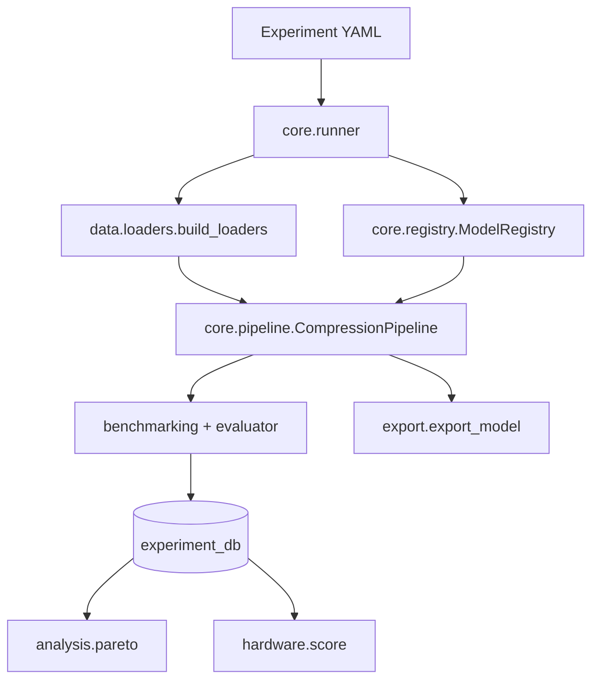

# Architecture

A component-level tour of the PyTorch research framework
(`edge_ai_compression/`). The TensorFlow/Keras root scripts are a separate,
independent stack — see [deployment.md](deployment.md).

## Data flow

## Packages

| Package | Responsibility |
|---------|----------------|
| `core/` | `ExperimentConfig`, `ModelRegistry`, `CompressionPipeline`, and the `runner` that wires a YAML config into an end-to-end run. |
| `compression/` | The actual algorithms: `pruning/` (global unstructured + layerwise adaptive), `quantization/` (dynamic linear), `distillation/`, `combined/`, `scheduling/`. |
| `benchmarking/` | Latency profiler, memory profiler, `benchmark_model` harness, and the `Evaluator`/`ResultLogger`. |
| `optimization/` | `pareto/` (dominance + frontier), `search/` (NSGA-II), `scoring/`. |
| `hardware/` | Deployment `profiles` (device budgets) and `scoring` (feasibility). |
| `analysis/` | Post-hoc analysis: `pareto` CLI, ablation, sensitivity, diagnostics, visualization. |
| `experiment_db/` | Append-only run log (`csv`/`jsonl`) + per-run `artifacts/`, plus environment and model-summary capture. |
| `surrogate/`, `policy/` | Surrogate models over the results table and constraint-feasible selection. |
| `theory/` | Model-complexity math: parameter counts, size, sparsity, FLOP/MAC estimates. |
| `export/` | Serialize models to TorchScript / ONNX / JSON (and refuse TFLite honestly). |
| `data/`, `utils/` | Dataset loaders (incl. offline `fake`) and shared metric helpers. |
| `interfaces.py` | `Protocol`s for `Pruner`, `Quantizer`, `Distiller`, `Exporter`, `BenchmarkRunner`. |

## Key abstractions

- **`CompressionStage`** (`core/pipeline.py`) — an ABC with a single
  `apply(model, data) -> model`. `PruningStage`, `QuantizationStage`, and
  `DistillationStage` implement it; `CompressionPipeline` runs them in a
  configurable `compression_order`.
- **`ModelRegistry`** — name → constructor for `resnet18_cifar`,
  `mobilenet_v2_cifar`, `efficientnet_b0_cifar`, `small_cnn_student`.
- **Experiment DB** — `record_from_run(...)` builds an `ExperimentRecord`
  (fixed CSV schema); `write_artifacts(...)` persists config, metrics,
  `environment.json`, and `model_summary.json` under `results/artifacts/{id}/`.
- **`ParetoOptimizer`** — `compute_frontier(rows)` returns the non-dominated set
  across configurable maximize/minimize objectives.

## Design principles

1. **Offline-first.** Every code path has a network-free mode (`fake` dataset,
   synthetic benchmark input) so CI and demos never download anything.
2. **Structural typing.** New components target the `interfaces.py` `Protocol`s
   without inheritance.
3. **Honesty over polish.** Fake data, budget-not-measurement profiles, and
   refused-not-faked exports are labeled as such everywhere.
